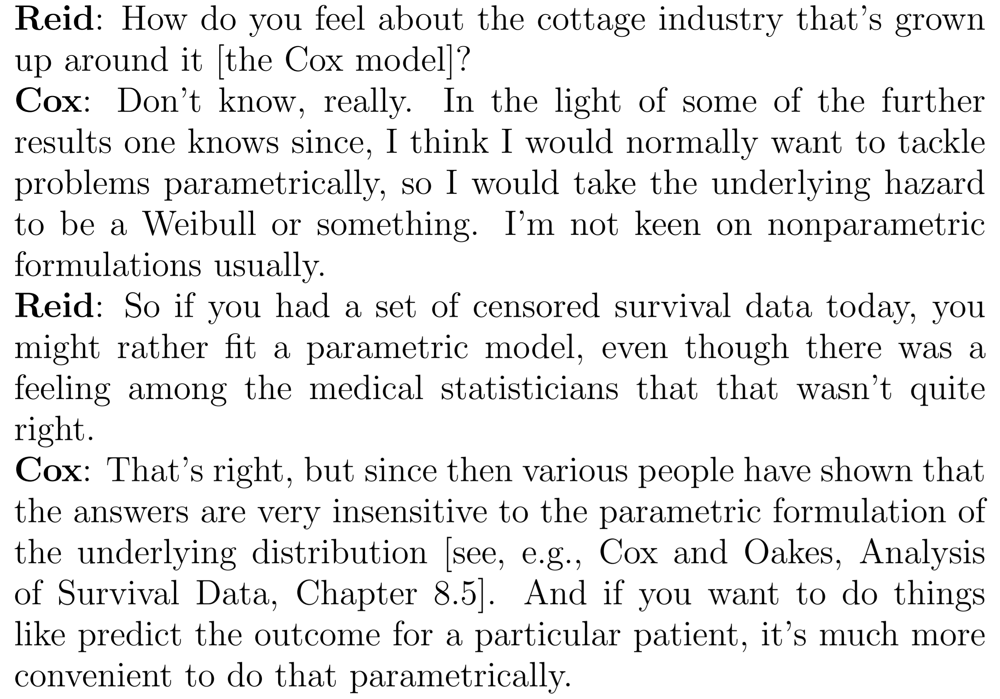

```{r setup, include=FALSE}
source("packages.R")
set.seed(1)
knitr::opts_chunk$set( warning=FALSE,message=FALSE,echo=FALSE)
knitr::opts_chunk$set(dev = 'pdf')
```


# Popular methods in time-to-event analysis 

* In disease etiology, we tend to make use of the proportional hazards hypothesis.
    * Cox Regression

* When we want the absolute risk:
    * Breslow estimator
    * Parametric models
    
# Motivations for a new method

* Julien and Hanley found that survival analysis rarely produces prognostic functions, even though the software is widely available in cox regression packages. [1]
* They believe the stepwise nature is the reason, as it reduces interpretability. [1]
* Want to easily model non-proportional hazards. [1]
* A streamlined approach for reaching a **smooth absolute risk** curve. [1]


# Dr. Cox's perspective



# Index pt 2.

* SUPPORT study
* Casebase sampling
* Logistic regression on survival data
* Maximum likelihood with regularization
* Comparing hazard models in SUPPORT study
* Absolute risk comparison
* Future work
* References

# SUPPORT dataset

* **Study to Understand Prognoses and Preferences for Outcomes and Risks Treatments**
* Design: Prospective cohort study.
* Setting: 5 academic care centers in the United States.
* Participants: 9105 hospitalized.
* Follow-up-time: 5.56 years.
* 68% incidence rate.

# SUPPORT manual imputation

* Notorious for missing data
\begin{table}[]
\centering
\resizebox{\textwidth}{!}{%
\begin{tabular}{ll}
\hline
Baseline Variable      & Normal Fill-in Value \\ \hline
Bilirubin              & 1.01                 \\
BUN                    & 6.51                 \\
Creatinine             & 1.01                 \\
PaO2/FiO2 ratio (pafi) & 333.3                \\
Serum albumin          & 3.5                  \\
Urine output           & 2502                 \\
White blood count      & 9 (thousands)        \\ \hline
\end{tabular}%
}
\caption{Suggested imputation values. {[}Support site reference{]}}
\label{tab:my-table}
\end{table}

# SUPPORT automated imputation

* mice imputation package (R)

1. PMM (Predictive Mean Matching)  – For numeric variables
2. logreg(Logistic Regression) – For Binary Variables (with 2 levels)
3. polyreg(Bayesian polytomous regression) – For Factor Variables (>= 2 levels)
4. Proportional odds model (ordered, >= 2 levels)

# Removed variables

* Hospital Charges.
* Patient ratio of costs to charges.
* Patient Micro-costs.
* Ordinal functional disability.
* Income (ordinal).

# Variable overview

* Age, sex, race, education, follow-up time, death. (6)
* Disease group/class, Number of comorbidities. (3)
* Income, costs. (4)
* Coma score, average Therapeutic Intervention Scoring System (2)
* Physiological variables. (11)
* Activities of daily living. (3)
* Previous model findings. (8)

# Original SUPPORT analysis

* Determined SUPPORT prognostic model on phase I (4301 individuals).
* Tested on Phase II (4028 individuals).
* Both on the scale of 180 days.
* Write out complicated model?????
* image of SPS vs APS ???????

# SUPPORT question

* How does their model perform over 5.56 years?
* Absolute Risk comparison.

# Analysis Process

1. Impute
2. Compare SPS and APS over ~5.56 years using absolute risk curves.
3. Compare to Kaplan-Meier curve
4. Compare to full model (excluding SPS and APS)

* All models is trained on 80% of the observations.
* Remaining observations are used to generate comparative absolute risk curves.

```{r data processing,include=FALSE}
ew <- read_csv("support2.csv")
data<-read.csv('support2.csv', col.names=colnames(ew), fill=TRUE, header=TRUE)
rm(ew)
```


```{r cleaningImputation,include=FALSE}
#manual imputation
data$alb[is.na(data$alb)]=3.5
data$pafi[is.na(data$pafi)]=333.3
data$bili[is.na(data$bili)]=1.01
data$crea[is.na(data$crea)]=1.01
data$bun[is.na(data$bun)]=6.51
data$wblc[is.na(data$wblc)]=9
data$urine[is.na(data$urine)]=2502

# automated imputation
previousModelPositions<-c(18,19,20,21,22,23,24,25,26,27,28,29)

supportMain<-data[,-previousModelPositions]
supportPrevious<-data[,previousModelPositions]
#keep 1,2 after imputation from previous usable models.

#missingPattern<-md.pattern(supportMain)
supportMainImpute <-mice(supportMain[,-c(11,34,13,14,15)], m = 1,printFlag=FALSE) #impute while removing ordinal variables and other response variables.
imputedData<-cbind(complete(supportMainImpute,1),supportPrevious[,c(1,2)])
#adls is missing 33%, and is removed accordingly and hospitaldeath
#md.pattern(completeData)
completeData<-na.omit(imputedData[,-c(4,29)])
workingCompleteData=model.matrix(death~ .-d.time,data=completeData)[,-c(1)]#remove intercept
#Create u and xCox, which will be used when fitting Cox with glmnet.
newData=workingCompleteData
x=workingCompleteData
#x and y will be used to fit the casebase model under glmnet.
#x=as.matrix(sparse.model.matrix(death~ .-d.time+0,data=workingData))
y=data.matrix(completeData[,c(2,5)])
```


```{r CoxExplorationModels,include=FALSE, eval = TRUE}
fullDataCox<-as.data.frame(cbind(as.numeric(y[,2]),as.numeric(y[,1]),x))
train_index <- sample(1:nrow(fullDataCox), 0.8 * nrow(fullDataCox))
test_index <- setdiff(1:nrow(fullDataCox), train_index)

train<-fullDataCox[train_index,]
test<-fullDataCox[test_index,]
coxSPS<- survival::coxph(Surv(time=V1,event=V2) ~ sps, data = train)
abcoxSPS<-survival::survfit(coxSPS,newdata = test)

coxAPS<- survival::coxph(Surv(time=V1,event=V2) ~ aps, data = train)
abcoxAPS<-survival::survfit(coxAPS,newdata = test)

coxFull<- survival::coxph(Surv(time=V1,event=V2) ~ .-sps -aps, data = train)
abcoxFull<-survival::survfit(coxAPS,newdata = test)

KM<- survival::coxph(Surv(time=V1,event=V2) ~ 1, data = test)
abKM<-survival::survfit(KM)
abKMcompare<-cbind(abKM$time[abKM$time<=1631],1-abKM$surv[abKM$time<=1631])
colnames(abKMcompare)<-c("Time","KM")

baseCoxComparisonData<-cbind(abcoxSPS$time[abcoxSPS$time<=1631],1-rowMeans(abcoxSPS$surv[abcoxSPS$time<=1631,]),1-rowMeans(abcoxAPS$surv[abcoxSPS$time<=1631,]),1-abKM$surv,1-rowMeans(abcoxFull$surv[abcoxSPS$time<=1631,]))
colnames(baseCoxComparisonData)<-c("Time","SPS","APS","Unadjusted","Full")
myColors <- brewer.pal(5,"Dark2")
```


# SPS vs APS
```{r SPSvsAPS,include=TRUE}
#Full
ggplot(as.data.frame(baseCoxComparisonData), aes(Time)) + 
  geom_line(aes(y = APS, colour = "APS"),lwd=2) +
  geom_line(aes(y = SPS, colour = "SPS"),lwd=2) +
  scale_colour_manual(name = "Models",values = myColors[c(3,4)])
```

# SPS vs APS
```{r SPSvsAPSZoom,include=TRUE}
#ZOOM
ggplot(as.data.frame(baseCoxComparisonData), aes(Time)) + 
  geom_line(aes(y = APS, colour = "APS"),lwd=2) +
  geom_line(aes(y = SPS, colour = "SPS"),lwd=2) + 
 scale_x_continuous(limits = c(1000, 1250))+
  scale_colour_manual(name = "Models",values = myColors[c(3,4)])
```


# SPS vs. Kaplan-Meier
```{r SPSvsKM,include=TRUE}
ggplot(as.data.frame(baseCoxComparisonData), aes(Time)) + 
  geom_line(aes(y = APS, colour = "APS"),lwd=2) +
  geom_line(aes(y = SPS, colour = "SPS"),lwd=2) +
  geom_step(data=as.data.frame(abKMcompare),mapping=aes(x=Time,y=KM,color="Unadjusted"),lwd=2)+
  scale_colour_manual(name = "Models",values = myColors[c(3,4,2)])
```

# SPS vs. Kaplan-Meier
```{r SPSvsKMZoom,include=TRUE}
ggplot(as.data.frame(baseCoxComparisonData), aes(Time)) + 
  geom_line(aes(y = APS, colour = "APS"),lwd=2) +
  geom_line(aes(y = SPS, colour = "SPS"),lwd=2) +
  geom_step(data=as.data.frame(abKMcompare),mapping=aes(x=Time,y=KM,color="Unadjusted"),lwd=2)+
  scale_x_continuous(limits = c(1000, 1250))+
  scale_colour_manual(name = "Models",values = myColors[c(3,2,4)])
```


# All covariates vs. physiology scores vs unadjusted
```{r FullvsKM,include=TRUE}
ggplot(as.data.frame(baseCoxComparisonData), aes(Time)) + 
  geom_line(aes(y = APS, colour = "APS"),lwd=2) +
  geom_line(aes(y = SPS, colour = "SPS"),lwd=2) + 
  geom_step(data=as.data.frame(abKMcompare),mapping=aes(x=Time,y=KM,color="Unadjusted"),lwd=2)+
  geom_line(aes(y = Full, col = "All Covariates without SPS APS"),lwd=2)+
  scale_colour_manual(name = "Models",values = myColors[c(1,3,2,4)])
```

* Conclusion: linear associations without physiology scores performs similarly to physiology scores. (SPS and APS) (USE IPA)
* Will use full model without physiology scores and unadjusted curve as comparative measures to our method based on casebase sampling.


```{r ,include=TRUE}
ggplot(as.data.frame(baseCoxComparisonData), aes(Time)) + 
  geom_step(data=as.data.frame(abKMcompare),mapping=aes(x=Time,y=KM,color="Unadjusted"),lwd=2)+
  geom_line(aes(y = Full, colour = "Full"),lwd=2)+
  scale_colour_manual(name = "Models",values = myColors[c(1,2)])
```


# Casebase Overview

1. Clever sampling.
2. Implicitly deals with censoring.
3. Allows a parametric fit using *logistic regression*.

* Casebase is parametric, and allows different parametric fits by incorporation of the time component.
* Package contains an implementation for generating *population-time* plots.

# Casebase: Sampling

```{r DataModel, echo=FALSE, warning=FALSE,message=FALSE,include=TRUE, out.width = '80%'}
nobs <- nrow(data)
ftime <- data$d.time
ord <- order(ftime, decreasing = FALSE)
#ordSample=order(sample(ord,1000))
yCoords <- cbind(cumsum(data[ord, "death"] == 1),
cumsum(data[ord, "death"] == 0))
yCoords <- cbind(yCoords, nobs - rowSums(yCoords))
aspectRatio <- 0.75
height <- 8.5 * aspectRatio; width <- 11 * aspectRatio
cases <- data$death == 1
comps <-data$death == 2
# randomly move the cases vertically
moved_cases <- yCoords[cases[ord], 3] * runif(sum(cases))
moved_comps <- yCoords[comps[ord], 3] * runif(sum(comps))
moved_bases <- yCoords[cases[ord], 3] * runif(sum(cases))
plot(0, type = 'n', xlim = c(0, max(ftime)), ylim = c(0, nobs),
xlab = 'Follow-up time (days)', ylab = 'Population',cex.lab=1.5, cex.axis=1.5, cex.main=1.5, cex.sub=1.5)
ptsz=1
```

# Casebase: Sampling
```{r , echo=FALSE, warning=FALSE,message=FALSE,include=TRUE, out.width = '80%'}
plot(0, type = 'n', xlim = c(0, max(ftime)), ylim = c(0, nobs),
xlab = 'Follow-up time (days)', ylab = 'Population',cex.lab=1.5, cex.axis=1.5, cex.main=1.5, cex.sub=1.5)
a=polygon(c(0, 0, ftime[ord], max(ftime), 0),
c(0, nobs, yCoords[,3], 0, 0),
col = "grey60")
legend("topright", legend = c("Base"),
col = c("grey60"),
pch = 19,cex=1.5)
```

# Casebase: Sampling
```{r , echo=FALSE, warning=FALSE,message=FALSE,include=TRUE, out.width = '80%'}
plot(0, type = 'n', xlim = c(0, max(ftime)), ylim = c(0, nobs), legend=TRUE,
xlab = 'Follow-up time (days)', ylab = 'Population',cex.lab=1.5, cex.axis=1.5, cex.main=1.5, cex.sub=1.5)
polygon(c(0, 0, ftime[ord], max(ftime), 0),
c(0, nobs, yCoords[,3], 0, 0),
col = "grey60")
points((ftime[ord])[cases[ord]], yCoords[cases[ord],3], pch = 19,
col = "firebrick3", cex = ptsz)
legend("topright", legend = c("Base","Death"),
col = c("grey60","firebrick3"),
pch = 19,cex=1.5)

```

# Casebase: Sampling
```{r,echo=TRUE,eval=FALSE}
casebase::popTime(Data,Event,Time)
```
```{r , echo=FALSE, warning=FALSE,message=FALSE,include=TRUE, out.width = '80%'}

plot(0, type = 'n', xlim = c(0, max(ftime)), ylim = c(0, nobs),
xlab = 'Follow-up time (days)', ylab = 'Population',cex.lab=1.5, cex.axis=1.5, cex.main=1.5, cex.sub=1.5)
polygon(c(0, 0, ftime[ord], max(ftime), 0),
c(0, nobs, yCoords[,3], 0, 0),
col = "grey60")
points((ftime[ord])[cases[ord]], moved_cases, pch = 19,
col = "firebrick3", cex = ptsz)
#points((ftime[ord])[bases[ord]], moved_bases, pch = 19,
#col = "blue", cex = ptsz)
legend("topright", legend = c("Base","Death"),
col = c("grey60","firebrick3"),
pch = 19,cex=1.5)


```
# Casebase: Sampling
```{r,echo=TRUE,eval=FALSE}
casebase::popTime(Data,Event,Time)
```
```{r , echo=FALSE, warning=FALSE,message=FALSE,include=TRUE, out.width = '80%'}

plot(0, type = 'n', xlim = c(0, max(ftime)), ylim = c(0, nobs),
xlab = 'Follow-up time (days)', ylab = 'Population',cex.lab=1.5, cex.axis=1.5, cex.main=1.5, cex.sub=1.5)
polygon(c(0, 0, ftime[ord], max(ftime), 0),
c(0, nobs, yCoords[,3], 0, 0),
col = "grey60")
points((ftime[ord])[cases[ord]], moved_bases, pch = 19,
col = "blue", cex = ptsz)
points((ftime[ord])[cases[ord]], moved_cases, pch = 19,
col = "firebrick3", cex = ptsz)
#points((ftime[ord])[bases[ord]], moved_bases, pch = 19,
#col = "blue", cex = ptsz)
legend("topright", legend = c("Base","case-series (Death)","base-series"),
col = c("grey60","firebrick3", "blue"),
pch = 19,cex=1.5)


```


# log-odds = log hazard

$$e^{\hat{L}}=\frac{Pr(Y=1|x,t)}{Pr(Y=0|x,t)}=\frac{h(x,t)*B(x,t)}{b[B(x,t)/B]}=\frac{h(x,t)*B}{b} $$
$$  \frac{b*e^{\hat{L}}}{B}=\hat{h(x,t)}$$
$$log(\hat{h(x,t)})= \hat{L}+log(\frac{b}{B})$$

* $\hat{L}=\beta X$
* $b$ = base-series.
* $B$ = Base.
* *B(x,t)* =  Base at time $t$.


# Wolfe's variance for case-to-base ratio

$$(\frac{1}{c}+\frac{1}{b})^{-1}$$
$$(\frac{1}{c}+\frac{1}{100c})^{-1}$$


# maximum likelihood, with regularization

* should I show it?

# Casebase: Parametric families
* We can now fit models of the form:
$$\ log(h(t;\alpha,\beta))=g(t;\alpha)+\beta X$$
* By changing the function $g(t;\alpha)$, we can model different parametric families easily:


# Casebase: Parametric models
*Exponential*: $g(t;\alpha)$ is equal to a constant
```{r,echo=TRUE,eval=FALSE}
casebase::fitSmoothHazard(status ~ X1 + X2)
```
*Gompertz*: $g(t;\alpha)=\alpha t$
```{r,echo=TRUE,eval=FALSE}
casebase::fitSmoothHazard(status ~ time + X1 + X2)
```
*Weibull*: $g(t;\alpha) = \alpha log(t)$
```{r,echo=TRUE,eval=FALSE}
casebase::fitSmoothHazard(status ~ log(time) + X1 + X2)
```


# Absolute Risk
* We have a bunch of different parametric hazard models now.
* To get the absolute risk, we need to evaluate the following equation in relation to the hazard:
$$CI(x,t)=1-e^{-\int^{t}_{0}h(x,u)du}$$
* *CI(x,t)*= Cumulative Incidence (Absolute Risk)
* *h(x,u)*= Hazard function

* Lets use the weibull hazard


# models to be compared

* casebase surv weibull-> LASSO
* cox surv
* cox surve -> LASSO
* Kaplan-meier


```{r supportSetUp, echo = FALSE, eval = TRUE}

ratio=10  #universal ratio for TRUE
#keep one individual out, at random, for which we will develop an 
#absolute risk curve.
#sam=sample(1:nrow(completeData), )
#Set workingData to the remaining individuals in the data
#workingData=completeData[-c(sam),]


#x and y will be used to fit the casebase model under glmnet.
#x=as.matrix(sparse.model.matrix(death~ .-d.time+0,data=workingData))
y=data.matrix(train[,c(2,1)])
colnames(y)<-c("death","d.time")
x=data.matrix(train[,-c(2,1)])
newData=data.matrix(test[,-c(2,1)])
```

```{r coxHazAbsolute, echo = FALSE }
#Create u and xCox, which will be used when fitting Cox with glmnet.

u=survival::Surv(time = as.numeric(y[,2]), event = as.factor(y[,1]))

xCox=as.matrix(cbind(data.frame("(Intercept)"=rep(1,each=length(x[,1]))),x))
colnames(xCox)[1]="(Intercept)"

#hazard for cox using glmnet
coxNet=glmnet::cv.glmnet(x=x,y=u, family="cox",alpha=1)
#convergence demonstrated in plot
#plot(coxNet)
#taking the coefficient estimates for later use
nonzero_covariate_cox <- predict(coxNet, type = "nonzero", s = "lambda.1se")
nonzero_coef_cox <- coef(coxNet, s = "lambda.1se")
#creating a new dataset that only contains the covariates chosen through glmnet.
#cleanCoxData<- as.data.frame(cbind(as.numeric(workingData$d.time),as.factor(workingData$death), xCox[,nonzero_covariate_cox$X1]))
cleanCoxData<-as.data.frame(cbind(d.time=as.numeric(y[,2]),death=as.numeric(y[,1]),x[,nonzero_covariate_cox$X1]))
#newDataCox<-xCox[sam,nonzero_covariate_cox$X1]
#fitting a cox model using regular estimation, however we will not keep it.
#this is used more as an object place holder.
coxNet <- survival::coxph(Surv(time=d.time,event=death) ~ ., data = cleanCoxData)
#The coefficients of this object will be replaced with the estimates from coxNet.
#Doing so makes it so that everything is invalid aside from the coefficients.
#In this case, all we need to estimate the absolute risk is the coefficients.
#Std. error would be incorrect here, if we were to draw error bars.
coxNet$coefficients<-nonzero_coef_cox@x
#Fitting absolute risk curve for cox+glmnet. -1 to remove intercept
#posCox=nonzero_covariate_cox$X1
#newDataCoxI=cleanCoxDataI[,posCox]

abcoxNet<-survival::survfit(coxNet,type="breslow",newdata=as.data.frame(newData[,nonzero_covariate_cox$X1]))


abCN=as.data.frame(cbind(abcoxNet$time, 1-rowMeans(abcoxNet$surv)))
colnames(abCN)<-c("Time","Absolute risk")
abCN$Model="Coxnet"
abCN=abCN[abCN$Time<=max(abKMcompare[,1]),]
#plot(abCN[,1],1-abCN[,2])
```

```{r cbHazard}, echo = FALSE, eval = TRUE}

cbFull=casebase::fitSmoothHazard.fit(x,y,family="glmnet",time="d.time",event="death",formula_time = ~log(d.time),alpha=1,ratio=ratio)
```

```{r CBabsolute, echo = FALSE, eval = TRUE}
#Estimating the absolute risk curve using the newData parameter.
abCbFull=casebase::absoluteRisk(cbFull,time = seq(1,max(abKMcompare[,1]), 1000),newdata = newData , s="lambda.1se",method=c("numerical"))
abCB=data.frame(abCbFull[,1],rowMeans(abCbFull[,-c(1)]))

colnames(abCB)<-c("Time","Absolute risk")
abCB$Model="Penalized logistic"

ab=rbind(abCB,abCN)

```

# Survival comparison

```{r include=TRUE}
ggplot(as.data.frame(ab), aes(Time)) + 
  geom_line(aes(y = `Absolute risk`, colour = Model),lwd=2)+
  geom_step(data=as.data.frame(abKMcompare),mapping=aes(x=Time,y=KM,color="Unadjusted"),lwd=2)+
  scale_colour_manual(name = "Models",values = myColors[c(1,2,3)])
```


# IPA score

* Brier score equation
* Calibration and discrimination
* IPA score equation
* In progress

# Future work

* Survival GWAS


# References 1

1.Hanley, James A, and Olli S Miettinen. 2009. "Fitting Smooth-in-Time Prognostic Risk Functions via Logistic Regression." *The International Journal of Biostatistics 5 (1)*.

2.Saarela, Olli, and Elja Arjas. 2015. "Non-Parametric Bayesian Hazard Regression for Chronic Disease Risk Assessment." Scandinavian Journal of Statistics 42 (2). Wiley Online Library: 609–26. 

3.Saarela, Olli. 2015. "A Case-Base Sampling Method for Estimating Recurrent Event Intensities." *Lifetime Data Analysis*. Springer, 1–17

# References 2

4. REFFERENCE TO SUPPORT DATASET????.

5.Scrucca L, Santucci A, Aversa F. Competing risk analysis using R: an easy guide for clinicians. *Bone Marrow Transplant*. 2007 Aug;40(4):381-7. doi: 10.1038/sj.bmt.1705727.

6.Turgeon, M. (2017, June 10). Retrieved May 05, 2019, from https://www.maxturgeon.ca/slides/MTurgeon-2017-Student-Conference.pdf

# Tutorial and Slides
\begin{center}
Tutorial:

http://sahirbhatnagar.com/casebase/

Slides:

https://github.com/Jesse-Islam/ATGC_survival_presentation_Feb.27.2020

Questions?
\end{center}

